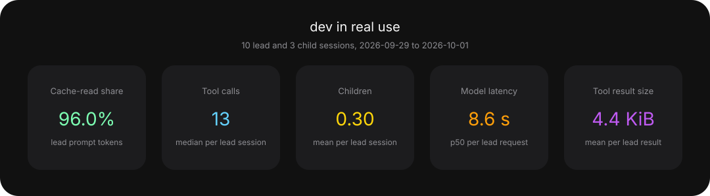

<p align="center">
  
</p>

<h1 align="center">dev</h1>

<p align="center">My personal agent distro built on top of <a href="https://github.com/earendil-works/pi">Pi</a>.</p>

## Why I made this

I wanted a terminal-first experience. I was a Hermes main, but I wanted to come back to the terminal, and its CLI was not that enjoyable. So I built the environment I wanted on Pi, which already owns inference, sessions and the TUI, and kept for myself only the parts Pi does not have.

## What it does

- **`dev`** opens Pi from the project you are working on, with one of the profiles defined in my local, untracked `profiles/` directory, which selects guidance and skills, and keeps private state out of the project and out of Git. [launcher](docs/launcher.md)
- **`work`** runs commands and delegated Pi children in the background, in separate processes, with version-controlled model dispatch and outcomes delivered back into the conversation. [work](docs/work.md), [dispatch](config/README.md)
- **`workspace`** lets several sessions and their children write to one repository without overwriting each other, allocating worktrees when needed and releasing them once the work is delivered. [workspace](docs/workspace.md)
- Long sessions prepare compaction in the background, independently for the lead and each child, then apply it at the first safe boundary. Pi's native blocking recovery remains available. [compaction](docs/compaction.md)
- The workflow itself (sizing, grilling, specs, implementation, review) comes from a shared skill library; dev owns only the integration.

The component map and decision-record index are in [ARCHITECTURE](docs/ARCHITECTURE.md). What dev trusts and what it does not protect: [SECURITY](SECURITY.md).

## Use dev

Dev is built for me: it assumes `pi` installed with the [pi.dev installer](https://pi.dev) (`curl -fsSL https://pi.dev/install.sh | sh`), the skill library at `~/.agents/skills`, and Node 26 or newer with a SQLite that carries the WAL-reset fix. Read [SECURITY](SECURITY.md) before installing.

```bash
cd ~/Developer/dev
npm ci
npm run setup
npm link --ignore-scripts
```

Profiles are personal and stay out of Git: `profiles/manifest.json` names each profile's guidance and skill directories, and dev refuses to start without it. The format is in the [launcher guide](docs/launcher.md#profiles-and-resources).

Then, from any Git project:

```bash
cd /path/to/your/project
dev
```

## Documentation

| Task                                        | Start here                             |
| ------------------------------------------- | -------------------------------------- |
| Launch, select a profile or resume          | [Launcher](docs/launcher.md)           |
| Run background commands or delegate         | [Work](docs/work.md)                   |
| Inspect retained work and release worktrees | [Workspace](docs/workspace.md)         |
| Understand long-session context handling    | [Compaction](docs/compaction.md)       |
| Interpret private metrics or export charts  | [Usage profile](docs/usage-profile.md) |
| Upgrade Pi and dev's dependencies           | [Upgrade](docs/upgrade.md)             |
| Change dev's code                           | [Development](docs/DEVELOPMENT.md)     |
| Find components and decision records        | [Architecture](docs/ARCHITECTURE.md)   |
| Look up domain terms                        | [CONTEXT](CONTEXT.md)                  |

Agent contributors start from [AGENTS.md](AGENTS.md); the [security model](SECURITY.md) applies to every integration.

## Performance

Measured on my own use of dev, not on benchmarks: every lead and child session file in my data home, abandoned branches included. Each chart names its sample size and date range.

<p align="center">
  
</p>

Tool-call percentages cover lead and child sessions, counting only calls with a recorded result. Calls without a result are excluded. “Success” means the tool returned without a recorded error, not that the task was correct.

Regenerate the aggregates with `npm run profile -- --export docs/performance`. Only allowlisted aggregates are committed; reports and drilldowns stay private unless explicitly exported. [Usage profile](docs/usage-profile.md) defines the metrics, sample rules and export boundary.
